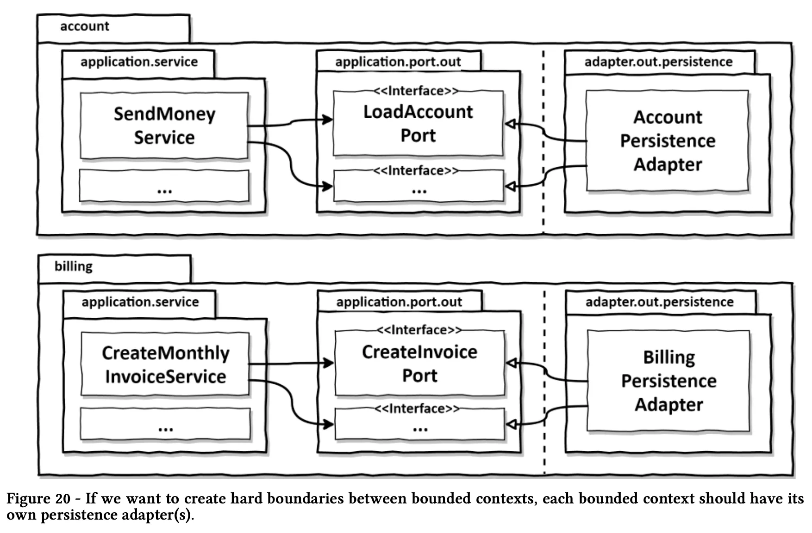

# Buckpal

## 介绍

基于《Get Your Hands Dirty on Clean Architecture》一书，实现的六边形架构风格的示例代码。

创建一个叫 buckpal 的 web 应用，实现如下功能：在账号之间进行转账

## 前置条件

- JDK 17
- SpringBoot
- lombok
- SpringJPA

## 传统的三层架构

- web 层：接收 request、路由到领域层
- 领域层：业务逻辑、调用持久化层组件查询领域实体或者修改领域实体的状态
- 持久化层：负责和数据库进行交互

### 三层架构存在的问题

（1）领域层依赖数据库，导致了基于数据库的设计和开发

通常，我们将 ORM 管理的实体作为持久层的一部分，如下图。持久层和领域层产生了强耦合关系

根据 SRP 单一职责原则，每个组件应该只有一个改变的原因。

对于上述分层结构，domain 层依赖于 persistence 层，那么 domain 层发生改变的原因除了业务变化外，还会由于 persistence 层的变动而改变，这不符合单一职责原则。

（2）对于分层架构，上面的层只能够访问同一层和下面的层。

那么，对于一些每一层都可能适用的公共类和工具类，就只能放到持久层了，虽然它们可能并不属于持久层。

（3）很难测试

分层架构中一个常见的演变趋势是：中间层会被跳过。

如果中间的领域层被跳过，那么后续的业务逻辑无法扩展，只能将业务逻辑添加到 web 层，混淆了两者的职责。

（4）隐藏了 usecase

作为开发，我们都喜欢写新的代码。但是，大多数情况下，我们都在修改已有的代码。
- web 层可以跳过 domain 层直接访问持久层；
- domain 层和持久层都可以访问一些公共组件；

这会导致修改已有的功能非常困难。

（5）无法支持并行工作

《人月神话》：adding manpower to a late software project makes it later。向一个已经延期的软件项目加人，只会使其更加延期。

如何让软件架构更好的支持并行工作？

## 依赖反转

### SRP 单一职责原则

Single Responsibility Principle：一个组件应该只做一件事。

解释：这里的“职责”解释为变化的原因，即一个组件变化的原因，应该只有一个。

对于三层架构来说，一个组件所依赖的每个组件都会成为该组件变化的原因。

### DIP 依赖倒置原则

对于分层架构，上层总是依赖下层。当我们对上层应用单一职责原则时，会发现下层的改变也会导致上层发生变化。

因为 domain 层依赖 persistence 层，所以任何 persistence 层的变化都可能会导致 domain 层的变化。由于 domain 层是最重要的代码，我们不希望 persistence 层的代码改动引起 domain 层的代码改动。

如何解决这个问题？**依赖倒置原则**

如何实现？**将 entity 移动到 domain 层，在 domain 层引入 repository 的接口，persistence 层实现 domain 层定义的 repository 的接口。**

### clean 架构

clean 架构的概念来自于《clena architecture》一书。

业务规则：被设计为可测试的、不依赖于框架、数据库、UI、外部应用或接口。

这意味着：领域层代码不能依赖外部，外部依赖于领域层代码。

下图从抽象层面描述了 clean architecture。

核心：**外层组件依赖内层组件**。

entity 是实体类，use cases 是分层架构中的 services，但是这里的 usecase 需要遵循单一职责原则。

缺点：因为 domain 层与外层（持久化、UI）完全解耦，需要在每一层维护一个 entity 模型。

### 六边形架构

六边形架构是对clean架构的一种实现。

#### 六边形架构：
- entity：实体类
- use case：调用 entity 和 output port，实现业务逻辑
- input port：接口，被 use case 实现
- web adapter：web 适配器，调用 input port
- external system adapter：外部系统适配器，调用input port
- output port：接口，被 use case调用
- persistence adapter：持久层适配器，实现 output port 接口
- external system adapter：外部系统适配器，实现 output port 接口

#### 包组织方式

原则：**包的组织方式要能反映软件架构**。

在外层还是以 feature 组织包结构，在 feature 内部以六边形架构来组织包结构。
- domain：领域模型 Account 和 Activity
- application：领域模型的 service 层
  - port.in：定义 input port 接口：SendMoneyUseCase
  - port.out：定义output port接口：LoadAccountPort 和 UpdateAccountStatePort
  - SendMoneyService：实现了 SendMoneyUseCase 这个 input port
- adapter：适配器
  ○ in：传入适配器，AccountController，会调用 application 的 input port
  ○ out：传出适配器，实现了应用层的 output port，会被 use case调用

这种包结构的另一个好处是它直接映射到 DDD 的概念。在我们的例子中，account 是一个有界上下文，它通过专用的入口和出口来与其他有界上下文进行通信。在 domain 包中，可以使用 DDD 提供的所有工具类来构建任何我们想要的领域模型。
没有十全十美的东西。通过这种富有表现力的包结构，我们至少可以缩小代码与架构之间的差距。

### 依赖注入

上面描述的包结构对于 clean 架构有很大的帮助，但这种体系结构的一个基本要求是应用层不依赖于传入和传出的适配器。

对于像 web 适配器这样的传入适配器，因为控制流（方法调用）的方向与依赖方向相同，适配器只是在应用层内部调用 service。

对于像持久层适配器这样的传出适配器，应用层不能依赖于适配器，但是又需要调用适配器的功能。我们需要使用依赖反转原则：在应用层创建一个传出适配器接口，该接口由适配器中的类来实现，然后应用层调用该接口来调用传出适配器的功能，如下图所示：

web controller 调用 service 实现的 input port，service 调用适配器实现的 output port。

## 如何实现

### 实现一个 domain 模型

Account、Activity

### 实现一个 UseCase

一个 usecase 是一个用例，做下面四件事情：
1. 从 incoming adapter 接收输入
2. 业务逻辑校验 （注意，不是输入校验）
3. 控制模型状态
4. 返回输出：将传出适配器的返回值转换为调用适配器需要的对象。
   
通常情况下，它会改变领域对象的状态，并将新状态传递给持久化适配器实现的传出接口。也有可能会调用其他传出适配器。

- 在 application.port.in 定义 UseCase 接口：SendMoneyUseCase
- 在 application.service 实现 UseCase 接口：SendMoneyService
- 在 application.port.out 定义 更新实体状态的 接口：UpdateAccountStatePort

为不同的 usecase 选择不同的 input model

为每个 usecase 创建一个定制化的 input model 会使得 usecase 更加清晰，与其他的 usecase 解耦。

#### input validate vs business rule validate

如何区分 input validate 和 business rule validate？

- 对 business rule 进行 validate需要获取当前 domain 模型的 state，而 input validate 不需要。
- input validate 可以使用声明式的注解，而 business rule 需要更多的上下文
- input validate 是句法校验，而 business rule 是在当前 usecase 上下文的语义校验

对于转账这个 usecase 来说：
- 原账户必须存在、目标账户必须存在，转账金额必须大于 0 属于 input validate
- 账户不能透支（转账金额必须小于原账户当前余额）属于业务规则校验

业务规则校验在哪里实现？最好是放在 domain 实体中，次之放在 usecase 的实现逻辑中。

#### 充血模型 vs 贫血模型

对于充血模型，在实体中实现尽可能多的业务逻辑，比如 Account 实体。对于充血模型，usecase 扮演的是对于领域模型的入口点的角色。

对于贫血模型，实体类只包含属性和它们的 getter、setter 方法，不包含任何领域逻辑。所有的业务逻辑都由 usecase 来实现，比如业务规则校验、修改实体状态、将修改后的实体传递给输出 port。

对于六边形架构来说，两种实现方式都可以。

### 实现一个 web adapter

作用：接受外部请求，转化为对应用核心层的调用

- application.port.in：定义接口
- adapter.in.web：调用接口的方法
- application.service：实现接口

web adapter 的职责

- 将 HTTP request 转换为 java 对象
- 鉴权
- 输入校验（这里指的是 web adapter 的 input model，而非 usecase 的 input model）
- 将输入转化为 use case 的 input model
- 调用 usecase
- 将 usecase 的返回值转换为 HTTP response
- 返回 HTTP response

### 实现持久层 adapter

- application.port.out 定义接口
- 在 application.service 路径下的 service 依赖（调用） 定义的接口
- 在 adapter.out.persistence 路径下，实现接口

总体来说，adapter 层依赖 application 层

#### persistence adapter 的职责

负责与数据库进行交互，包括：
- 接收输入（可能是 domain）
- 将输入转换为数据库的输入模型，对于 java 来说，常用的是 JPA 的 entity。将 domain entity 对象转换为 JPA entity 对象，后者反映数据库表的结构。

#### 有界上下文（bounded context）：

